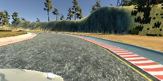
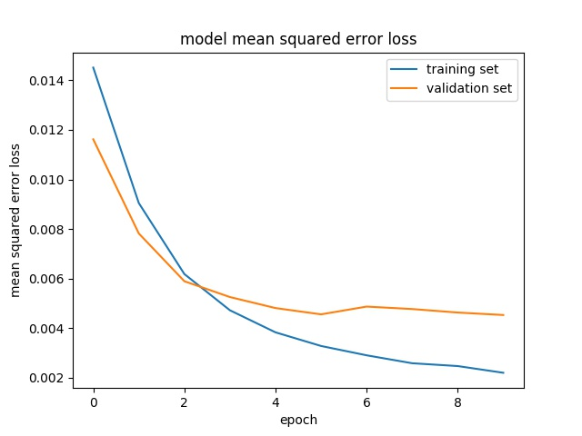

# Behavioral Cloning

## Introduction

This document describes the solution design and neural network architecture
used for the CarND behavioral cloning project.

The goals / steps of this project are the following:

* Use the simulator to collect data of good driving behavior
* Build, a convolution neural network in Keras that predicts steering angles from images
* Train and validate the model with a training and validation set
* Test that the model successfully drives around track once without leaving the road
* Summarize the results with a written report

### Rubric Points

In the sections that follow I will consider the
[rubric points](https://review.udacity.com/#!/rubrics/432/view) individually
and describe how I addressed each point in my implementation.  

## Solution Design and Approach

In order to come up with a solution for this project I went through the
following steps.

I started out by building a simple one neuron network that attempted to drive
the car around the track and was trained on the provided example data. I did
this to verify that I was able to successfully read the generated data and at
least have something that would attempt to drive the car. Clearly a single
neuron network is nowhere near complex enough to predict the steering angles
needed to drive around the track. For this simple network and each of the
subsequent networks I tried I settled on using the mean squared error for the
loss function and an adam optimizer to make parameter updates so it was not
necessary to tune the learning rate manually.

Next I replaced my single neuron network with a LeNet neural network using the
ReLu activation and added a pre-processing and data normalization layer at the
start of the network.

The pre-processing step involved cropping the images to only include parts of
the image relevant to navigating around the track.

*Image prior to being cropped:*


*Same image after being cropped:*


*Note how parts of the image irrevelant to navigation are mostly removed from
the cropped image.*

The normalization layer simply centered each of the RGB pixel values around 0
so that instead of each value ranging between 0 and 255, the pixel values
ranged between -0.5 and 0.5. The formula for this was as follows:

```
normalized = (pixel / 255) - 0.5
```

In addition to cropping and normalization I also augmented the dataset by using
images from the left and right cameras and also flipping each of the training
images and then reversing the steering angles for the flipped images. After
collecting my own dataset I found had a sufficient amount of data that I did
not need to augment the dataset with flipped images but I did continue to use
data from the left and right cameras.

*Image from center camera on a straightaway:*


*Same image from left camera on a straightaway:*


*Compared to the image from the center camera, the steering angle needs to be
corrected by driving further to the right, or a positive angle.*

*Same image from right camera on a straightaway:*


*Compared to the image from the center camera, the steering angle needs to be
corrected by driving further to the left, or a negative angle.*

*Image from center camera on a curve:*


*Image from left camera on a curve:*


*Note how in this image the correct steering angle would to drive further to
the right compared to the image from the center camera.*

*Image from right camera on a curve:*



*Note how in this image the correct steering angle would to drive further to
the left compared to the image from the center camera.*

By emperical experiments using a steering correction offset of 0.20 radians or
11.46 degrees seemed to give the best results.

The LeNet network with the augmented dataset seemed to perform a bit better but
the car was still not able to drive around the track autonomously.
After experimenting a bit with the LeNet network I decided to move to a more
complex network architecture developed by the team at Nvidia. This network is
documented at
[this link](https://devblogs.nvidia.com/parallelforall/deep-learning-self-driving-cars/)

This network architecture was developed through emperical experiments. After
implementing this network I trained it again on the provided example data and
realized some improvement however the car was still not able to navigate
successfully around the track. At this point I decided to shift my focus onto
generating my own training data especially given that my model seemed to be
fitting the data quite nicely. See the section on "Data Collection" for details
on my data collection strategy.

I realized a significant improvement in the ability of the car to drive around
the track after collecting my own data and did not need to resort to using
additional pre-processing techniques.

To determine the optimal number of epochs, I created a plot showing the
training and validation loss against the current epoch number.



After epoch 6 the network starts overfitting as evidenced by the declining
training loss and increasing validation loss. After determining this I trained
my network for 6 epochs only. While the resulting model did not do too badly,
the car tires did go over the lane lines. I found that training for 3 epochs
seemed to give the best results.

### Dropout Layers

For my final model I did not use dropout layers. I made this decision for
two reasons:

1. The trained model not using dropout layers performed the best in my test
runs around the track in autonomous mode.
2. I was able to acheive much lower validation error without dropout layers.
3. The Nvidia architecture I used also did not use dropout layers.

My experiments with dropout layers involved adding them after the convolutional
layers and the fully connected layers. I tried using dropout rates of 0.50 and
0.25. In both cases I was not able to realize the same validation error I got
without using them despite training for 10 epochs (vs 3 epochs without them).

It is possible that placing them differently in the network or varying the
dropout rates between layers would have made a difference but in my experience
these layers seemed to make it take much longer to train with worse results.

## Model Architecture

As mentioned above, my solution uses the network architecture developed by
Nvidia's self-driving car team. For completeness, here is a diagram of the
neural network architecture:


As you can see, the architecture consists of the following:

* Input Layer
* Normalization Layer
* 3 5x5 convolutional layers that use a stride of 2 with output depths of 24,
  36 and 48
* 2 3x3 convolutional layers that use an output depth of 64
* 3 fully connected layers
* Output layer

## Data Collection

My strategy for collecting data was as follows:

1. 3 laps of center lane driving both clockwise and counter-clockwise.
2. 2 laps of recovery driving both clockwise and counter-clockwise and
   recovering from both the left-hand side and right-hand side of the track.

Center lane driving involved simply driving car around the track keeping the
car as close to the center lane as possible (and almost enlisting help from the
neighbours kids as I realized I was not very good). In the end I managed to
train myself to keep the car in the middle.

Recovery driving involved driving the car to the edge of a track, but not off
the track, and then driving back to the center.

*Image showing start of recovery from the left:*


*Image showing partial recovery from the left:*


*Image showing completion of recovery from the left:*


## Implementation Details

As mentioned in the README, the file [model.py](model.py) contains the source
code used to train the model. The sections below walk through the code used
to train the model in detail.

### Sample Dataset Setup

Lines 94-106 is where the list of samples is populated. Each entry in the
samples list is a tuple of ground truth steering angle and the corresponding
image file. Line 104 appends the sample for the center camera, line 105 appends
the sample for the left-hand camera applying a positive steering angle
correction and line 106 appends the sample for the right-hand camera applying
a negative steering angle correction. The steering correction angle to use is
defined on line 88.

### Model Definition

The model is defined on lines 116 to 130. On line 117 a cropping layer is added
followed by the normalization layer on line 119. Lines 120 to 130 then define
the neural network architecture developed by Nvidia as mentioned above.

### Model Training

The model is trained on lines 132 to 137. As can be seen on line 132, the loss
function requested in the mean squared error and the adam optimizer is used.

### Generators

The images in the training set are 320x160 pixels with 3 RGB values per pixel.
To train my model I collected 8036 samples with 3 images per sample, one for
each of the center, left and right cameras. Loading all of these images into
memory would therefore require 320x160x3x8036x3 = 3.70 x 10^9 bytes of memory
or about 3.7 GB exclusive of overhead and assuming each RGB byte value is
stored as 8 bits. Converting the RGB values to ints or floats during processing
would quadruple this amount. This meant that loading the entire dataset into
memory was not going to work. To resolve this I made use of python generators
which allowed for my implementation to load images into memory on-demand.

My data generator function is defined on lines 31 to 63. It takes as arguments
the directory containing the data, the array containing all of the samples as
tuples and a batch size argument specifying the number of images to yeild on
each call to the generator. The main generator loop starts on line 44. On line
45 the list of samples is shuffled. The for loop on line 46 iterates through
the entire dataset passed to the generator stepping by the batch size. The
inner for loop starting on line 51 loads each image in the batch populating
lists of images and measurements for each image. On line 63 the current batch
to yeild is returned.

This approach illusrates the classic time-space tradeoff encountered for many
Compuer Science problems; using the generator means that the same images will
be loaded from disk multiple times incurring an IO performance cost at the
benefit of reduced memory consumption.

### Training / Validation Data Split

To validate the model, 20% of the data using for training is split off into a
validation dataset. The samples are split into training and validation datasets
on line 105. Two separate instances of the generator function are defined on
lines 106 and 107. The generator functions are fed into the neural network for
training on line 129 where the Keral Model.fit_generator function is used.

### Miscellaneous

The utility function `csv_log_to_image_filename` defined on line 13 is used to
take an absolute filename as provided in the csv log file and convert it to
a filename relative to the data directory. This was needed so that data could
be collected on one computer and the network trained on another computer.

### Example Training Output

The following shows an example invocation to train the model on a Amazon GPU
instance:

```
(carnd-term1) carnd@ip-172-31-8-241:~/CarND-Behavioral-Cloning-P3$ python model.py my_data
Using TensorFlow backend.
I tensorflow/stream_executor/dso_loader.cc:128] successfully opened CUDA library libcublas.so locally
I tensorflow/stream_executor/dso_loader.cc:128] successfully opened CUDA library libcudnn.so locally
I tensorflow/stream_executor/dso_loader.cc:128] successfully opened CUDA library libcufft.so locally
I tensorflow/stream_executor/dso_loader.cc:128] successfully opened CUDA library libcuda.so.1 locally
I tensorflow/stream_executor/dso_loader.cc:128] successfully opened CUDA library libcurand.so locally
Loading csv data...
Training...
Epoch 1/10
I tensorflow/stream_executor/cuda/cuda_gpu_executor.cc:937] successful NUMA node read from SysFS had negative value (-1), but there must be at least one NUMA node, so returning NUMA node zero
I tensorflow/core/common_runtime/gpu/gpu_device.cc:885] Found device 0 with properties: 
name: GRID K520
major: 3 minor: 0 memoryClockRate (GHz) 0.797
pciBusID 0000:00:03.0
Total memory: 3.94GiB
Free memory: 3.91GiB
I tensorflow/core/common_runtime/gpu/gpu_device.cc:906] DMA: 0 
I tensorflow/core/common_runtime/gpu/gpu_device.cc:916] 0:   Y 
I tensorflow/core/common_runtime/gpu/gpu_device.cc:975] Creating TensorFlow device (/gpu:0) -> (device: 0, name: GRID K520, pci bus id: 0000:00:03.0)
51660/51660 [==============================] - 144s - loss: 0.0145 - val_loss: 0.0116
Epoch 2/10
51660/51660 [==============================] - 137s - loss: 0.0090 - val_loss: 0.0078
Epoch 3/10
51660/51660 [==============================] - 136s - loss: 0.0062 - val_loss: 0.0059
Epoch 4/10
51660/51660 [==============================] - 138s - loss: 0.0047 - val_loss: 0.0052
Epoch 5/10
51660/51660 [==============================] - 135s - loss: 0.0038 - val_loss: 0.0048
Epoch 6/10
51660/51660 [==============================] - 137s - loss: 0.0033 - val_loss: 0.0046
Epoch 7/10
51660/51660 [==============================] - 137s - loss: 0.0029 - val_loss: 0.0049
Epoch 8/10
51660/51660 [==============================] - 138s - loss: 0.0026 - val_loss: 0.0048
Epoch 9/10
51660/51660 [==============================] - 138s - loss: 0.0025 - val_loss: 0.0046
Epoch 10/10
51660/51660 [==============================] - 138s - loss: 0.0022 - val_loss: 0.0045
All done.
```

### Driving the Car Around the Track Autonomously

After starting the simulator in autonomous mode, my model can be used to drive
the car around the track by executing the following command:

```
python drive.py model.h5
```

